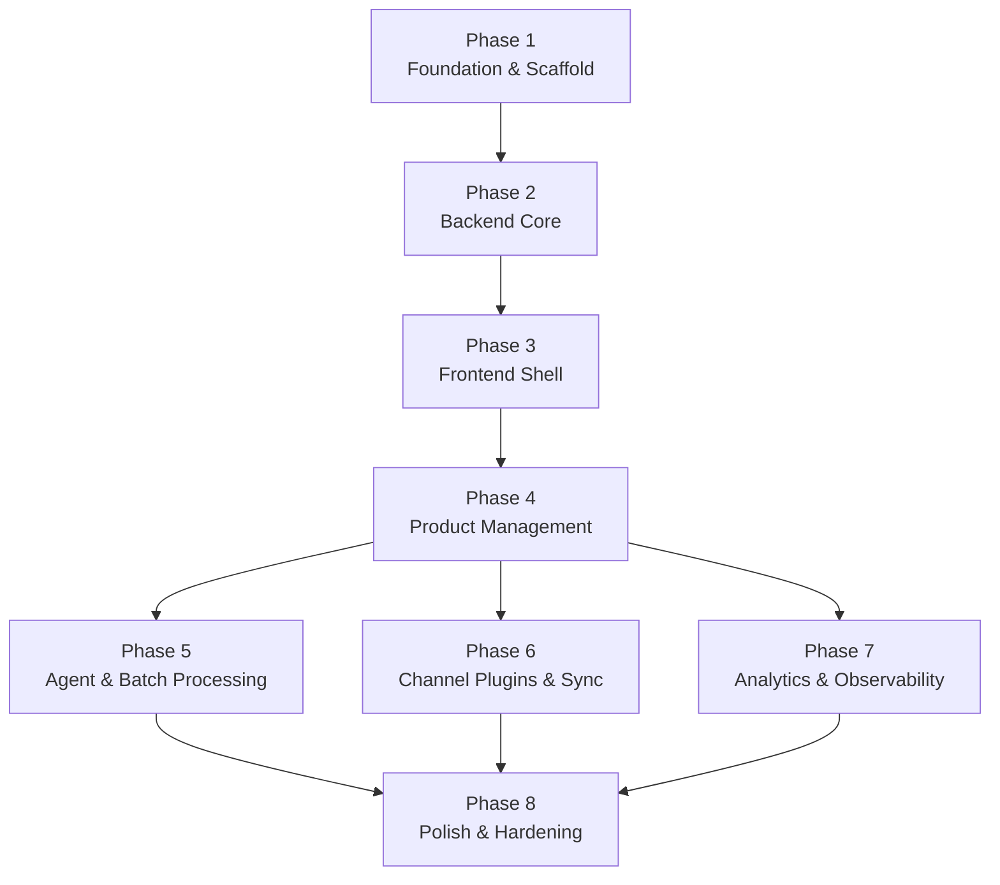

# Build Plan — Thrift Store Sales Channel Manager

This document defines the phased build plan for standing up the full project from scratch. Each phase builds on the previous one and produces a demonstrable increment. Phases are ordered to minimize risk early (infrastructure, core data model, auth) and layer features on top.

## 1. Purpose & Scope

Provide a phase-by-phase roadmap for implementing the complete system so the team has a shared sequence and knows what "done" means at each stage.

## 2. Definitions

| Term | Definition |
|------|------------|
| Increment | A working, demonstrable slice of the system produced at the end of a phase |
| Greenfield | Building from scratch with no existing codebase |
| MVI | Minimum Viable Increment — the smallest phase that delivers user value |

## 3. Phase Overview

The build is organised into three sequential waves followed by a parallel fan-out:

| Wave | Phases | Why |
|------|--------|-----|
| **Foundation** (sequential) | 1–4 | Infrastructure, backend core, frontend shell, product management — each unlocks the next |
| **Feature** (parallel) | 5–7 | Agent batch processing, channel plugins, and analytics can all be built concurrently once product management is in place |
| **Hardening** (sequential) | 8 | Polish and production readiness — last because it touches everything |

```
P1 ──► P2 ──► P3 ──► P4 ────┬──► P5 ──┐
                            ├──► P6 ──┤──► P8
                            └──► P7 ──┘
```

## 4. Phase Details

### Phase 1: Foundation & Infrastructure

**Goal**: One `docker compose up` boots the entire stack with working inter-service connectivity.

**Deliverables**:
- `infra/docker/docker-compose.yml` with services for postgres, redis, backend, frontend, task-worker
- `infra/env/.env.example`, `.env.backend`, `.env.frontend` with all connection strings and secrets
- `Makefile` with convenience targets: `make up`, `make down`, `make logs`, `make test`
- `.github/workflows/ci.yml` — lint (ruff, prettier), type-check, test on PR
- Root `.gitignore` and `.pre-commit-config.yaml`

**Acceptance**:
- `make up` starts all services without errors
- Backend `/health/live` returns 200
- Frontend home page loads in browser at localhost:3000

---

### Phase 2: Backend Core

**Goal**: A working FastAPI application with database models, auth, and health probes.

**Deliverables**:
- `backend/app/main.py` — FastAPI app factory with lifespan hooks
- `backend/app/core/config.py` — pydantic-settings loading from `.env`
- `backend/app/core/security.py` — CORS, CSP headers
- `backend/app/db/` — SQLAlchemy Base, session factory, Alembic config
- `backend/app/db/models/user.py` — User model with hashed password
- `backend/app/db/models/item.py` — Product / Item model
- `backend/app/api/v1/endpoints/auth.py` — register, login, token refresh
- `backend/app/api/v1/endpoints/items.py` — CRUD for products
- `backend/app/services/auth_service.py` — JWT creation/verification (jose + libpass)
- `backend/app/health.py` — `/health/live`, `/health/ready`, `/health/startup`
- `backend/app/lifespan.py` — graceful shutdown
- `backend/app/middleware/rate_limit.py` — slowapi rate limiter
- `backend/tests/` — conftest, test_auth, test_items
- `backend/alembic/` — initial migration

**Acceptance**:
- `POST /api/v1/auth/register` creates a user and returns a JWT
- `POST /api/v1/auth/login` returns access + refresh tokens
- `POST /api/v1/auth/refresh` returns a new access token
- `GET /api/v1/items` returns paginated items (empty array initially)
- `POST /api/v1/items` creates an item when authenticated
- `/health/ready` returns 200 only when DB is reachable
- Rate-limited endpoint returns 429 after exceeding limit

---

### Phase 3: Frontend Shell

**Goal**: A working NextJS application with login, routing, and a typed API client.

**Deliverables**:
- `frontend/package.json` with NextJS 16+, TailwindCSS 4+, TypeScript
- `frontend/next.config.ts` configured for API proxy to backend
- `frontend/app/layout.tsx` — root layout with fonts and global styles
- `frontend/app/(auth)/login/page.tsx` — login form
- `frontend/app/(auth)/register/page.tsx` — registration form
- `frontend/app/dashboard/page.tsx` — dashboard shell with sidebar
- `frontend/components/layout/` — Header, Sidebar, Footer
- `frontend/components/ui/` — Button, Input, Card, Table primitives
- `frontend/lib/api-client.ts` — typed fetch wrapper with JWT injection
- `frontend/lib/auth.ts` — token storage, refresh interceptor
- `frontend/styles/globals.css` — TailwindCSS imports

**Acceptance**:
- Login form calls backend and stores JWT
- Authenticated users are redirected to `/dashboard`
- Unauthenticated users are redirected to `/login`
- Dashboard layout renders with sidebar navigation
- API client injects Bearer token and retries on 401

---

### Phase 4: Product Management

**Goal**: Employees can create, view, and edit products with image uploads to R2.

**Deliverables**:
- `backend/app/db/models/item.py` — expanded Product model (images, categories, condition, etc.)
- `backend/app/services/storage_service.py` — S3-compatible R2 upload, presigned URL generation
- `backend/app/api/v1/endpoints/assets.py` — upload image, get presigned URL
- `backend/app/api/v1/endpoints/items.py` — expanded with image references, search/filter
- `frontend/app/dashboard/products/` — product list, create, edit pages
- `frontend/components/forms/ProductForm.tsx` — product creation/editing form
- `frontend/components/ui/ImageUploader.tsx` — drag-and-drop with R2 presigned upload

**Acceptance**:
- Employee can create a product with title, category, condition, measurements, price
- Employee can upload images that are stored in R2 (not on the app server)
- Product detail page shows images served via presigned URLs
- Employee can search/filter products by category, status, date range
- Employee can edit a product and see changes reflected immediately

---

### Phase 5: Agent & Batch Processing

**Goal**: Employees can queue agent batches for description/pricing improvements and review suggestions.

**Deliverables**:
- `task-worker/app/` — Celery app with Redis broker, task definitions
- `task-worker/app/tasks/agent_tasks.py` — LLM agent for description & pricing suggestions
- `backend/app/db/models/batch.py` — BatchJob, AgentSuggestion models
- `backend/app/api/v1/endpoints/batches.py` — CRUD for batch jobs, review queue
- `backend/app/services/agent_service.py` — orchestrates agent task submission and result handling
- `frontend/app/dashboard/products/[id]/review/page.tsx` — suggestion review screen
- `frontend/app/dashboard/batches/` — batch creation and status pages

**Acceptance**:
- Employee can select products and queue an agent-improved descriptions batch
- Task worker processes the batch and stores suggestions
- Employee sees a notification when suggestions are ready
- Employee can accept, edit, or reject each suggestion with one click
- Accepted description changes update the product record

---

### Phase 6: Channel Plugins & Sync

**Goal**: Products can be published to external sales channels and cross-channel sale sync works.

**Deliverables**:
- `backend/app/services/channel_plugin.py` — abstract plugin interface
- `backend/plugins/shopify/` — first channel plugin implementation
- `backend/app/services/listing_service.py` — creates/disables listings across channels
- `backend/app/api/v1/endpoints/listings.py` — listing CRUD
- `backend/app/services/inventory_sync.py` — sale webhook handling and cross-channel deactivation
- `frontend/app/dashboard/listings/` — listing management pages

**Acceptance**:
- Employee can publish a product to Shopify (or mock) via the dashboard
- Listing appears in the dashboard with status (active/paused/sold)
- When a product sells on one channel, all other listings are automatically disabled
- Product status updates to "Sold" in the central catalog

---

### Phase 7: Analytics & Observability

**Goal**: The team can observe system health, trace requests across services, and see how products are performing.

**Deliverables**:
- `analytics/app/` — FastAPI analytics service with MongoDB
- `analytics/app/api/ingest.py` — tracking pixel and event ingestion endpoints
- `infra/docker/docker-compose.observability.yml` — OTel Collector, Jaeger, Mongo
- `infra/otel/otel-collector-config.yml` — trace + metrics pipeline
- `infra/jaeger/` — Jaeger configuration
- Backend instrumentation with OpenTelemetry middleware
- 1×1 tracking pixel endpoint in the storefront
- Dashboard sections for listing view counts and product performance

**Acceptance**:
- Tracking pixel returns a 1×1 transparent PNG and logs the event
- Instrumented request appears in Jaeger with spans across backend → task-worker
- Dashboard shows view counts per listing
- Analytics service ingests and stores events in MongoDB

---

### Phase 8: Polish & Hardening

**Goal**: Production readiness — security, error states, test coverage, and edge cases.

**Deliverables**:
- Comprehensive test coverage (unit + integration for backend, component tests for frontend, one E2E smoke test)
- `frontend/tests/e2e/` — Playwright smoke test for login → create product flow
- `backend/app/middleware/request_validation.py` — input sanitization layer
- Error boundaries in frontend (404, 500, network error pages)
- Loading states and empty states for all dashboard screens
- `scripts/setup.sh` — bootstrap script for new devs
- `scripts/seed.py` — database seed data with sample products
- Final pass on README.md with setup instructions

**Acceptance**:
- All tests pass
- A new developer can go from `git clone` to running the app with one script
- All dashboard screens handle loading, empty, and error states gracefully
- Rate limiting is active and returns proper 429 responses

## 5. Dependency Graph



**Hard dependencies** (must be sequential):
- Phase 1 → Phase 2 → Phase 3 → Phase 4 → any Phase 5/6/7 → Phase 8

**Parallel tracks** (can overlap after Phase 4):
- Phase 5 (Agent & Batch), Phase 6 (Channel Plugins), and Phase 7 (Analytics) can all be built concurrently
- Phase 6 depends on Phase 2 for plugin interface patterns, not on product data, so it can start alongside Phase 5/7 after Phase 4 is complete

## 6. Success Criteria

- **Phase 2** (MVI): An authenticated user can register, log in, and perform basic product CRUD via the API
- **Phase 4** (MVP): An employee can create a product with images and manage it from the dashboard
- **Phase 6** (Core differentiation): Products are listed on external channels and cross-channel sale sync works
- **Phase 8** (Production readiness): All tests pass, security hardening is complete, documentation is up to date

## 7. Risks & Mitigations

| Risk | Impact | Mitigation |
|------|--------|------------|
| Channel API rate limits or breaking changes | Listings fail silently | Plugins are isolated behind an adapter interface; each channel gets a circuit breaker and retry logic |
| LLM agent quality is poor for niche product categories | Employees reject suggestions | Review step is mandatory; agent quality can be improved independently of the pipeline |
| R2 cold start latency on presigned URL generation | Slow image load for first request | Cache presigned URLs client-side; generate URLs lazily on image request |
| No real channel API keys during development | Cannot test end-to-end listing flow | Build with mock/dummy plugin first; swap real keys later |