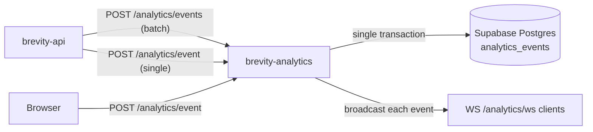

# Brevity.app — Analytics Batch Events Endpoint

**Status:** Implemented  
**Depends on:** [analytics-storage.md](./analytics-storage.md), [api-routes.md](./api-routes.md)  
**ADR:** Unchanged — ingest remains unauthenticated (ADR-0006)

---

## 1. Overview

Add a **batch ingest endpoint** to `brevity-analytics` so upstream services can
send multiple analytics events in a single HTTP request instead of one request
per event.

| Aspect | Today | After |
|--------|-------|-------|
| Single event | `POST /analytics/event` | Unchanged |
| Batch ingest | N/A | `POST /analytics/events` |
| DB writes | One `INSERT` per request | One transaction, multi-row insert |
| WebSocket | One broadcast per event | One broadcast per stored event |

**Scope:** `brevity-analytics` HTTP API and `EventStore`. Caller adoption in
`brevity-api` and `brevity` is optional follow-up (see §8).

**Non-goals:** auth on ingest; changing the single-event endpoint; batch reads
(`GET /analytics/events` is already paginated); client-side buffering in the
browser.

---

## 2. Motivation

`brevity-api` emits one analytics event per user action via
`analytics_client.emit_event()`. That is fine for interactive traffic, but it
does not scale when a service needs to record many events at once — for example:

- Backfilling or replaying events after downtime
- Flushing a buffered queue of domain events
- Recording multiple correlated events from one server-side operation without
  N round-trips to analytics

A batch endpoint reduces HTTP overhead and lets Postgres persist events in one
transaction.

---

## 3. Architecture



- **Single-event path stays** — `POST /analytics/event` is not deprecated.
- **Same data model** — batch inserts into existing `analytics_events` table; no
  schema migration.
- **Same event types** — reuse `EventType` literals from `schemas.py`.

---

## 4. HTTP contract

### 4.1 Endpoint

| Method | Path | Auth | Description |
|--------|------|------|-------------|
| `POST` | `/analytics/events` | No | Record multiple analytics events |

`GET /analytics/events` already exists for listing. Using the same path with a
different method is intentional: the collection resource supports read (GET) and
bulk create (POST).

### 4.2 Request body

```json
{
  "events": [
    {
      "event_type": "like_created",
      "user_id": "550e8400-e29b-41d4-a716-446655440000",
      "metadata": { "post_id": "660e8400-e29b-41d4-a716-446655440001" }
    },
    {
      "event_type": "follow_created",
      "user_id": "550e8400-e29b-41d4-a716-446655440000",
      "metadata": { "target_user_id": "770e8400-e29b-41d4-a716-446655440002" }
    }
  ]
}
```

| Field | Type | Required | Notes |
|-------|------|----------|-------|
| `events` | `EventCreateRequest[]` | Yes | Non-empty array; each item matches the single-event schema |

Reuse `EventCreateRequest` from `schemas.py` for each array element. Do not
accept a bare JSON array at the top level — the wrapper leaves room for future
batch-level options (e.g. `idempotency_key`) without breaking clients.

### 4.3 Success response — `201 Created`

```json
{
  "events": [
    {
      "id": "a1b2c3d4-e5f6-7890-abcd-ef1234567890",
      "event_type": "like_created",
      "user_id": "550e8400-e29b-41d4-a716-446655440000",
      "metadata": { "post_id": "660e8400-e29b-41d4-a716-446655440001" },
      "created_at": "2026-08-28T14:30:00.000000+00:00"
    },
    {
      "id": "b2c3d4e5-f6a7-8901-bcde-f12345678901",
      "event_type": "follow_created",
      "user_id": "550e8400-e29b-41d4-a716-446655440000",
      "metadata": { "target_user_id": "770e8400-e29b-41d4-a716-446655440002" },
      "created_at": "2026-08-28T14:30:00.000000+00:00"
    }
  ],
  "count": 2
}
```

| Field | Type | Notes |
|-------|------|-------|
| `events` | `EventResponse[]` | Stored events in **request order** |
| `count` | `int` | Same as `len(events)`; convenience for metrics/logging |

### 4.4 Error responses

| Status | When |
|--------|------|
| `422 Unprocessable Entity` | Body fails Pydantic validation (missing `events`, invalid `event_type`, etc.) |
| `413 Payload Too Large` | Batch exceeds configured max size (see §5.3) |
| `500 Internal Server Error` | Database or unexpected server failure |

**Atomic semantics (v1):** the entire batch succeeds or fails. If any event fails
validation before the DB write, return `422` with standard FastAPI validation
detail. If the insert fails, roll back the transaction and return `500`; no
partial persistence.

Partial success (`207 Multi-Status`) is out of scope for v1.

### 4.5 Headers

Same as single-event ingest:

| Header | Direction | Notes |
|--------|-----------|-------|
| `Content-Type: application/json` | Request | Required |
| `traceparent` | Request | Optional W3C trace context; applied to the batch span |
| `X-Process-Time-Ms` | Response | Existing middleware |

---

## 5. Application design

### 5.1 Schemas (`schemas.py`)

```python
class EventBatchCreateRequest(BaseModel):
    events: list[EventCreateRequest] = Field(..., min_length=1)


class EventBatchResponse(BaseModel):
    events: list[EventResponse]
    count: int
```

Add a Pydantic validator (or route dependency) to enforce `max_length` on
`events` (see §5.3).

### 5.2 Route (`main.py`)

```python
@app.post(
    "/analytics/events",
    response_model=EventBatchResponse,
    status_code=status.HTTP_201_CREATED,
)
async def create_events_batch(
    request: Request,
    body: EventBatchCreateRequest,
) -> EventBatchResponse:
    ...
```

Behavior mirrors `create_event`:

1. Extract and attach W3C trace context from request headers.
2. Start OTel span `analytics.store_events_batch` with attribute
   `analytics.batch_size`.
3. Call `event_store.insert_events_batch(...)`.
4. `await ws_manager.broadcast(event)` for **each** stored event (same payload
   shape as today).
5. Log `event batch stored` with `count` and `status_code: 201`.
6. Return `EventBatchResponse`.

Register this route **before** or ensure it does not conflict with the existing
`GET /analytics/events` handler (FastAPI distinguishes by method).

### 5.3 Limits

| Limit | Default | Env override (optional) |
|-------|---------|-------------------------|
| Max events per batch | `100` | `ANALYTICS_BATCH_MAX_SIZE` |
| Min events per batch | `1` | — |

Reject batches larger than the max with `413` and body:

```json
{ "detail": "Batch size 150 exceeds maximum of 100" }
```

FastAPI/Pydantic `max_length` on `events` produces `422`; prefer an explicit
`413` check in the route or a custom validator so oversize batches are
distinguishable from malformed items.

### 5.4 EventStore (`event_store.py`)

Add a batch insert method; keep `insert_event` unchanged.

```python
def insert_events_batch(
    self,
    *,
    events: list[dict[str, Any]],  # each: event_type, user_id, metadata
) -> list[dict[str, Any]]:
    ...
```

**Implementation:**

- Generate `id` and `created_at` per row in Python (same as single insert).
- Use **one connection, one transaction** (`with conn.transaction():`).
- Prefer `executemany` with the existing `INSERT_EVENT_SQL`, or a multi-row
  `INSERT ... VALUES (...), (...)` built from a list of parameter dicts.
- Return rows in request order via `RETURNING` (order by insertion sequence or
  explicit ordinality).

Do not call `insert_event` in a loop — that would open N transactions and defeat
the purpose of batching.

### 5.5 SQL

Reuse the parameterized single-row insert. For `executemany`:

```sql
INSERT INTO analytics_events (id, event_type, user_id, metadata, created_at)
VALUES (%(id)s, %(event_type)s, %(user_id)s, %(metadata)s, %(created_at)s)
RETURNING id, event_type, user_id, metadata, created_at
```

psycopg3 `executemany` with `RETURNING` returns all rows when using
`conn.execute` with a sequence of parameter dicts. Verify row count matches
input count; raise if not.

**No migration required** — same table and columns as [analytics-storage.md](./analytics-storage.md) §4.

### 5.6 Observability

| Signal | Detail |
|--------|--------|
| Span name | `analytics.store_events_batch` |
| Span attributes | `analytics.batch_size`, `analytics.event_type` (first event only, or omit per-type in v1) |
| Log field | `count`, `path: /analytics/events`, `method: POST` |
| Metrics | Existing `record_request` middleware covers latency/status by path |

---

## 6. Caller integration (optional follow-up)

Not required for the analytics service to ship the endpoint.

### 6.1 `brevity-api` — `analytics_client.py`

Add a sibling to `emit_event`:

```python
def emit_events_batch(
    *,
    events: list[dict[str, Any]],  # event_type, user_id, metadata
    traceparent: str | None = None,
    otel_context: Any = None,
) -> None:
    """Best-effort batch emit; never raise into the request path."""
```

- `POST {ANALYTICS_URL}/analytics/events` with `{"events": [...]}`.
- Propagate `traceparent` on the outbound request (same as single emit).
- Inject each event's `traceparent` into `metadata` only if callers need
  per-event trace linkage; for v1, a single batch-level `traceparent` header is
  sufficient.
- Log `analytics batch emitted` with `count` and status code.
- Timeout: scale with batch size, e.g. `min(10.0, 2.0 + 0.05 * len(events))`.

Existing `emit_event` call sites stay on the single-event path until there is a
concrete batching use case.

### 6.2 `brevity` frontend — `lib/analytics.ts`

**No change in v1.** Page views are single events; batching adds complexity
without benefit for browser traffic.

---

## 7. Security and operations

Unchanged from [analytics-storage.md](./analytics-storage.md) §10 and ADR-0006:

- Ingest remains open (no auth).
- Batch endpoint increases abuse surface (large payloads). Mitigate with max
  batch size and standard reverse-proxy body limits in production.
- All SQL remains parameterized; never interpolate user input.

---

## 8. Implementation phases

| Phase | Work | Verify |
|-------|------|--------|
| 1. Schemas | `EventBatchCreateRequest`, `EventBatchResponse` | OpenAPI shows new models |
| 2. EventStore | `insert_events_batch` with single transaction | Manual script inserts 10 rows atomically |
| 3. Route | `POST /analytics/events` + WS broadcast loop | `curl` returns 201 with `count` |
| 4. Limits | Max batch size validation → 413 | Oversize batch rejected |
| 5. Telemetry | Batch span + structured log | Span visible in Jaeger |
| 6. Docs | Update [api-routes.md](./api-routes.md), architecture diagram | memory-bank consistent |
| 7. Caller (opt.) | `emit_events_batch` in `brevity-api` | Integration smoke test |

---

## 9. Acceptance criteria

- [ ] `POST /analytics/events` accepts a non-empty `events` array and returns
      `201` with stored `EventResponse` objects in request order
- [ ] `GET /analytics/events` behavior is unchanged
- [ ] `POST /analytics/event` behavior is unchanged
- [ ] Batch insert uses one DB transaction; failure rolls back all rows
- [ ] Each stored event is broadcast on `WS /analytics/ws`
- [ ] Batches over `ANALYTICS_BATCH_MAX_SIZE` (default 100) return `413`
- [ ] Empty `events` array returns `422`
- [ ] Invalid `event_type` in any item returns `422` with no rows persisted
- [ ] OpenTelemetry span `analytics.store_events_batch` includes batch size
- [ ] [api-routes.md](./api-routes.md) documents the new endpoint

---

## 10. Example requests

**Minimal batch:**

```bash
curl -s -X POST http://localhost:8001/analytics/events \
  -H "Content-Type: application/json" \
  -d '{
    "events": [
      { "event_type": "page_view", "metadata": { "path": "/timeline" } },
      { "event_type": "page_view", "metadata": { "path": "/profile" } }
    ]
  }'
```

**With trace context (server-to-server):**

```bash
curl -s -X POST http://localhost:8001/analytics/events \
  -H "Content-Type: application/json" \
  -H "traceparent: 00-4bf92f3577b34da6a3ce929d0e0e4736-00f067aa0ba902b7-01" \
  -d '{
    "events": [
      {
        "event_type": "post_created",
        "user_id": "550e8400-e29b-41d4-a716-446655440000",
        "metadata": { "post_id": "660e8400-e29b-41d4-a716-446655440001" }
      }
    ]
  }'
```

---

## Related

- [api-routes.md](./api-routes.md) — analytics endpoints and event types
- [analytics-storage.md](./analytics-storage.md) — Postgres storage layer
- [architecture.md](./architecture.md) — service topology and analytics flow
- [../decisions/0006-realtime-and-analytics-auth.md](../decisions/0006-realtime-and-analytics-auth.md) — unauthenticated ingest
