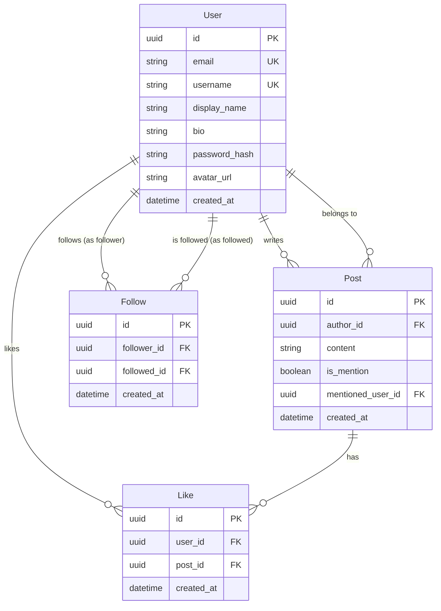

# Brevity.app — Data Model

## Models

### User

| Field | Type | Notes |
|-------|------|-------|
| `id` | UUID (PK) | Auto-generated |
| `email` | String (unique, indexed) | User's email address |
| `username` | String (unique, indexed) | Display handle, used for `@` mentions |
| `display_name` | String | Optional, defaults to username |
| `bio` | String | Optional, max 160 chars |
| `password_hash` | String | Hashed with libpass |
| `avatar_url` | String | Optional, Gravatar URL |
| `created_at` | DateTime | Auto-set on creation |

### Post

| Field | Type | Notes |
|-------|------|-------|
| `id` | UUID (PK) | Auto-generated |
| `author_id` | UUID (FK → User.id) | Who posted it |
| `content` | String | Single word (letters + numbers only), max 200 chars, **or** `@username` tag |
| `is_mention` | Boolean | True if content is `@username` |
| `mentioned_user_id` | UUID (FK → User.id, nullable) | Resolved user if `is_mention`; must exist at create time |
| `created_at` | DateTime | Auto-set on creation |

**Mention semantics:** A mention post is validated against an existing username.
Timeline for user U includes: (1) posts by users U follows, (2) posts where
`mentioned_user_id = U`, (3) posts by U. Mentions are not a separate inbox.

### Like

| Field | Type | Notes |
|-------|------|-------|
| `id` | UUID (PK) | Auto-generated |
| `user_id` | UUID (FK → User.id) | Who liked |
| `post_id` | UUID (FK → Post.id) | Which post |
| `created_at` | DateTime | Auto-set on creation |

**Unique constraint:** `(user_id, post_id)` — one like per user per post.

### Follow

| Field | Type | Notes |
|-------|------|-------|
| `id` | UUID (PK) | Auto-generated |
| `follower_id` | UUID (FK → User.id) | The user who follows |
| `followed_id` | UUID (FK → User.id) | The user being followed |
| `created_at` | DateTime | Auto-set on creation |

**Unique constraint:** `(follower_id, followed_id)` — prevents duplicate follows.
**Check constraint:** `follower_id != followed_id` — cannot follow yourself.

## ER Diagram

## Constraints Summary

| Constraint | Implementation |
|------------|---------------|
| Post content is one word | Pydantic validator: `^[a-zA-Z0-9]+$` or `^@[a-zA-Z0-9_]+$` |
| Max post length | 200 characters |
| One like per user per post | Unique constraint on `(user_id, post_id)` |
| One follow per pair | Unique constraint on `(follower_id, followed_id)` |
| Cannot follow yourself | Check constraint: `follower_id != followed_id` |
| Username uniqueness | Unique index on `User.username` |
| Email uniqueness | Unique index on `User.email` |