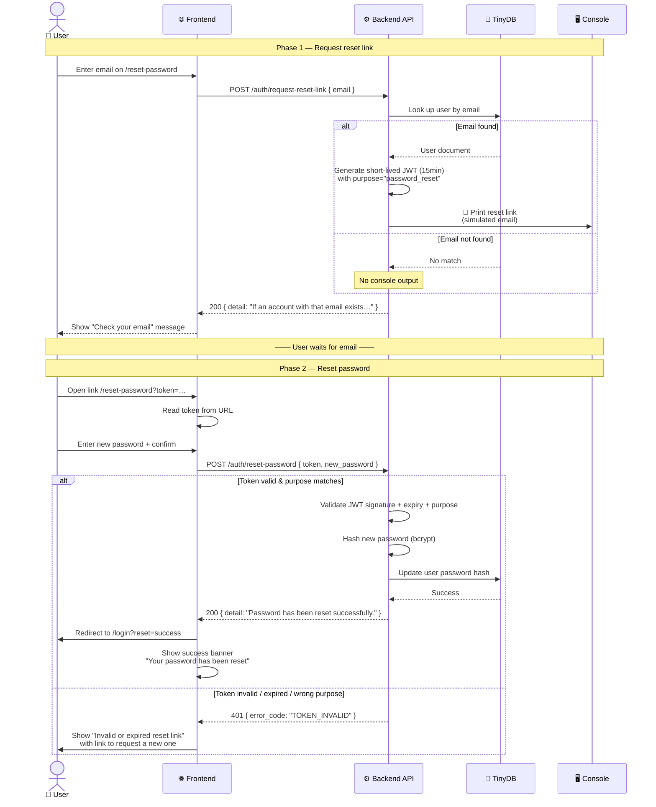

# Password Reset

> See also: [Backend Spec](backend.md) | [Security Spec](security.md) | [Frontend Spec](minimal-auth-frontend.md) | [Backend Safety Rules](../rules/backend-safety.md) | [General Safety Rules](../rules/general-safety.md)

This spec describes the password reset flow for the Auth Demo. Since there is no real email infrastructure, the reset link is printed to the backend terminal as a simulated email. Uses a short-lived JWT as the token embedded in the reset link.

## Flow Overview



## Reset Token

A password reset link embeds a JWT with a **short expiry** and an explicit `purpose` claim to prevent cross-use with auth tokens.

### Claims

| Claim | Type | Value |
|-------|------|-------|
| `sub` | `str` (UUID) | The user's unique identifier |
| `purpose` | `str` | `"password_reset"` — distinguishes this from auth tokens |
| `exp` | `int` (Unix timestamp) | Token expiration time |
| `iat` | `int` (Unix timestamp) | Token issued-at time |

### Example Decoded Payload

```json
{
  "sub": "550e8400-e29b-41d4-a716-446655440000",
  "purpose": "password_reset",
  "exp": 1712345678,
  "iat": 1712343878
}
```

### Signing & Expiry

| Property | Value |
|----------|-------|
| Algorithm | `HS256` (same as auth tokens) |
| Secret | `JWT_SECRET` (same as auth tokens) |
| Expiry | **15 minutes** (shorter than the 30-minute auth token expiry — configurable via `JWT_RESET_TOKEN_EXPIRY_MINUTES`) |
| Purpose validation | Backend **must** verify the `purpose` claim equals `"password_reset"` — an auth token passed to the reset endpoint must be rejected |

### Security Rationale

- **Short expiry** (15 min): Limits the window for a leaked reset link.
- **Purpose claim**: Prevents an attacker from using a stolen auth token to reset a password. The `POST /auth/reset-password` endpoint explicitly checks `purpose == "password_reset"`.
- **Same secret, different key space**: Uses the same `JWT_SECRET` for simplicity (no extra env vars), but the `purpose` claim creates a separate key space.

## Backend Routes

### `POST /auth/request-reset-link`

Accepts an email address, looks up the user, generates a short-lived password reset JWT, and prints the reset link to the backend console.

| Detail | Value |
|--------|-------|
| Auth required | No |
| Request body | `{ "email": str }` |
| Success (200) | `{ "detail": "If an account with that email exists, a reset link has been sent." }` |
| Errors | 422 (validation — invalid email format) |

**Important — always return 200:** To prevent email enumeration, the endpoint returns the same success message regardless of whether the email exists. The only visible difference is that the backend console only prints the link when the email is found.

**Console output (simulated email):**

```
📧 PASSWORD RESET LINK for <email>
   → http://localhost:3000/reset-password?token=<jwt>
   (expires in 15 minutes)
```

### `POST /auth/reset-password`

Accepts a reset token and a new password. Validates the token, verifies the `purpose` claim, and updates the user's password hash.

| Detail | Value |
|--------|-------|
| Auth required | No (the token itself is the credential) |
| Request body | `{ "token": str, "new_password": str }` |
| Success (200) | `{ "detail": "Password has been reset successfully." }` |
| Errors | 401 (invalid/expired token, wrong purpose), 422 (validation — password too short/long) |

**Validation rules for `new_password`:**

| Rule | Value |
|------|-------|
| Minimum length | 8 characters (same as registration) |
| Maximum length | 128 characters (same as registration) |
| Hashing | bcrypt via `passlib[bcrypt]` (same as registration) |

### Request/Response Schemas

#### `POST /auth/request-reset-link`

```json
// Request
{
  "email": "user@example.com"
}

// Response (200)
{
  "detail": "If an account with that email exists, a reset link has been sent."
}
```

#### `POST /auth/reset-password`

```json
// Request
{
  "token": "eyJhbGciOiJIUzI1NiIs...",
  "new_password": "myNewSecurePassword123"
}

// Response (200)
{
  "detail": "Password has been reset successfully."
}
```

### Error Codes

| `error_code` | HTTP Status | When |
|-------------|-------------|------|
| `VALIDATION_ERROR` | 422 | Invalid email format, password too short/long |
| `TOKEN_INVALID` | 401 | Token is malformed, expired, or has wrong `purpose` |

No new error codes are needed — existing `TOKEN_INVALID` and `VALIDATION_ERROR` cover all cases.

## Email Enumeration Prevention

The `POST /auth/request-reset-link` endpoint **always returns 200** with the same generic message, regardless of whether the email exists in the database. This prevents attackers from enumerating registered email addresses.

The only observable difference:
- Email exists → backend console prints the reset link
- Email does not exist → backend console prints nothing (the response is identical either way)

## Frontend Routes

### `/reset-password` (no token)

A form that accepts an email address to request a password reset link.

| Detail | Value |
|--------|-------|
| Auth required | No |
| Method | `GET` (renders form), `POST` via `<form action={handler}>` |
| Fields | email |
| Success | Shows "Check your email for the reset link" message |
| Errors | Shows validation error message (e.g., invalid email format) |

**Logic:**
1. User enters their email address.
2. Frontend calls `POST /auth/request-reset-link` with `{ email }`.
3. On success, show a confirmation message: "Check your email for the reset link."
4. On 422, show validation error.
5. The link in the "simulated email" is printed to the backend terminal.

**States:**
- **Default:** Form with email input and submit button. The login page links here via "Forgot your password?".
- **Loading:** Submit button shows "Sending…" and is disabled.
- **Success:** The form is replaced (or hidden) with a success message — no further action needed on this page.
- **Error:** Inline error message below the form (e.g., invalid email format).

### `/reset-password?token=<reset-token>` (with token)

A form that accepts a new password, given a valid reset token.

| Detail | Value |
|--------|-------|
| Auth required | No (the token is the credential) |
| Method | `GET` (renders form), `POST` via `<form action={handler}>` |
| Fields | new password, confirm password (client-side only) |
| Success | Redirects to `/login` with a success indicator (e.g., query param `?reset=success`) |
| Errors | Shows error message if token is invalid/expired, or password validation fails |

**Logic:**
1. The page reads the `token` query parameter from the URL.
2. User enters a new password (and confirms it).
3. On submit, frontend calls `POST /auth/reset-password` with `{ token, new_password }`.
4. On success, redirect to `/login?reset=success`.
5. On 401, show "Invalid or expired reset link" — offer a link to request a new one.
6. On 422, show validation error.

**States:**
- **Default (valid token):** Form with password fields. The token is read from the URL (kept in a hidden field, not shown to the user).
- **Loading:** Submit button shows "Resetting…" and is disabled.
- **Success:** Redirect to `/login?reset=success`.
- **Expired/invalid token:** Show error message: "This reset link is invalid or has expired." with a link back to `/reset-password` to request a new one.
- **Validation error:** Inline error (e.g., password too short).

### Updated Login Page

The login page shows a "Forgot your password?" link below the password field:

```html
<a href="/reset-password">Forgot your password?</a>
```

When the login page detects a `?reset=success` query parameter, it displays a success banner:

> "Your password has been reset successfully. Please log in with your new password."

## Implementation Details

### Backend — New Pydantic Models

Add to `models/user.py` (or a new `models/password_reset.py`):

```python
class RequestResetLinkRequest(BaseModel):
    """Request body for POST /auth/request-reset-link."""
    email: EmailStr


class ResetPasswordRequest(BaseModel):
    """Request body for POST /auth/reset-password."""
    token: str
    new_password: str = Field(min_length=8)

    @field_validator("new_password")
    @classmethod
    def password_max_length(cls, v: str) -> str:
        if len(v) > 128:
            raise password_too_long()
        return v
```

### Backend — New Config Variable

Add to `config.py`:

```python
jwt_reset_token_expiry_minutes: int = 15
```

### Backend — Console Output Format

The simulated email should print to the backend terminal with a clear, scannable format:

```
┌─────────────────────────────────────────────┐
│  📧 PASSWORD RESET                          │
│                                             │
│  To: user@example.com                       │
│                                             │
│  Click the link below to reset your         │
│  password (expires in 15 minutes):          │
│                                             │
│  http://localhost:3000/reset-password?      │
│    token=eyJhbGciOiJIUzI1NiIs...            │
│                                             │
│  If you didn't request this, ignore this    │
│  message.                                   │
└─────────────────────────────────────────────┘
```

### Frontend — New File

Create `src/app/reset-password/page.tsx` — a client component that handles both states (no token / with token) by checking the URL search params.

### Frontend — Navbar

No changes to the navbar. The reset-password page is a guest-accessible page, no different from login/register.

### Frontend — API Client

No changes to `lib/api.ts` needed. The existing `apiClient<T>(path, { method, body })` works for both endpoints since neither requires auth.

### Frontend — Auth Context

No changes to `lib/auth.tsx` needed. Password reset does not involve the auth context.

## Environment Variables

| Variable | Default | Description |
|----------|---------|-------------|
| `JWT_RESET_TOKEN_EXPIRY_MINUTES` | `15` | Lifetime of password reset tokens in minutes |

## Security Considerations

| Threat | Mitigation |
|--------|-----------|
| Email enumeration | `POST /auth/request-reset-link` always returns 200 regardless of whether the email exists |
| Auth token used as reset token | `purpose` claim is validated — auth tokens have no `purpose` claim, so they are rejected |
| Reset token used as auth token | Reset tokens carry `purpose: "password_reset"` and are short-lived, scoped to the reset endpoint only |
| Token replay | Short expiry (15 min) limits the window |
| Weak new password | Same validation rules as registration (8–128 chars, bcrypt hashing) |
| Token leaked in logs | The reset link is printed to the backend console only (not stored in the database). In production, this would be sent via email, not logged. |
| User deleted between issuance and use | `POST /auth/reset-password` validates the token (which contains the user UUID). If the user no longer exists, the endpoint returns 401 (token invalid) rather than revealing the user was deleted |

## Known Gaps (Post-MVP)

- **Email infrastructure:** The reset link is printed to the console. In production, this would be sent via a transactional email service (SendGrid, SES, etc.).
- **Rate limiting:** No rate limiting on the request-reset-link endpoint. An attacker could spam requests, but they would only see the same 200 response each time.
- **Token invalidation:** Issuing a new reset token does not invalidate previous ones. Each token is valid until it expires. In production, you might want to track used tokens.
- **Password strength meter:** No client-side password strength indicator. The password is only validated against the length rules.
- **Confirmation field:** The confirm-password field is a client-side UX concern only. The backend validates a single `new_password` field.
