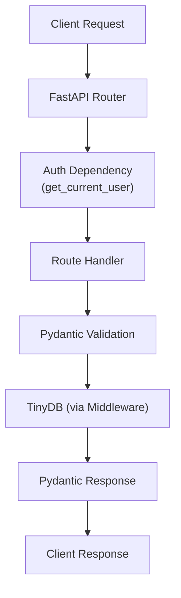
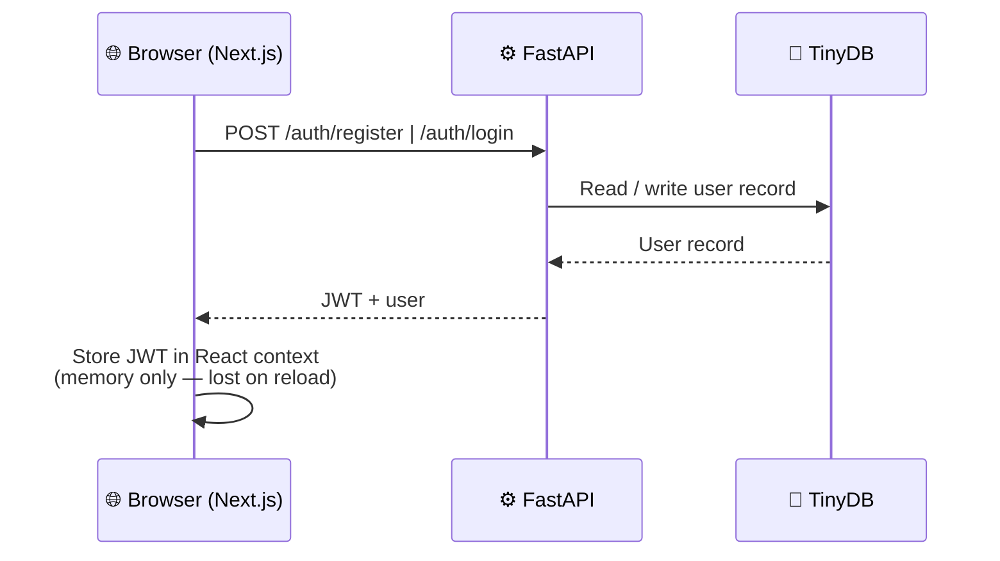

# Project Architecture Spec

> See also: [Backend Safety Rules](../rules/backend-safety.md) | [Database Safety Rules](../rules/database-safety.md) | [General Safety Rules](../rules/general-safety.md)

## Tech Stack

- **Monorepo tool:** turborepo for project organization
- **Package manager (JS):** `pnpm` (workspaces via `pnpm-workspace.yaml`)
- **Package manager (Python):** `uv` for python package management
- **Web framework (backend):** FastAPI
- **Web framework (frontend):** Next.js 16 (App Router, TypeScript strict)
- **Styling:** Tailwind CSS v4
- **Database:** TinyDB with a custom middleware that bridges Pydantic models and TinyDB documents
- **Auth libraries:** `python-jose[cryptography]` (JWT) and `libpass[bcrypt]` (password hashing; a maintained fork of `passlib`)

## Directory Structure

```
apps/
  backend/                 # FastAPI application
    main.py                # App entry point — creates the FastAPI app and mounts routers
    database.py            # TinyDB initialization and middleware setup
    models/
      user.py              # Pydantic User model
    routers/
      auth.py              # POST /auth/register, POST /auth/login, POST /auth/request-reset-link, POST /auth/reset-password
      users.py             # GET /user/{id}, PATCH /user/{id}
    dependencies.py        # FastAPI dependencies (e.g., get_current_user)
    config.py              # Settings loaded from environment variables
    backups/               # Auto-generated timestamped DB backups (gitignored)
  frontend/                # Next.js frontend (App Router)
    src/
      app/
        layout.tsx         # Root layout with AuthProvider + Navbar
        page.tsx           # Homepage — "Hello {user}!" / "Hello world"
        providers.tsx      # Client-side providers wrapper
        navbar.tsx         # Navbar (brand, nav links, logout)
        login/page.tsx     # Login page (with "Forgot your password?" link)
        register/page.tsx  # Registration page
        reset-password/page.tsx  # Password reset (email form + token form)
        user_profile/page.tsx  # Profile view/edit page (requires auth)
      lib/
        api.ts             # API client (fetch wrapper, ApiError)
        auth.tsx           # Auth context (in-memory JWT, login/logout/setUser)
packages/
  shared/                  # Placeholder for shared types (future)
```

## Environment Variables

| Variable | Default | Description |
|----------|---------|-------------|
| `DATABASE_PATH` | `data/db.json` | Path to the TinyDB JSON file |
| `JWT_SECRET` | *(required)* | Secret key used to sign JWT tokens |
| `JWT_ALGORITHM` | `HS256` | Signing algorithm for JWT |
| `JWT_EXPIRY_MINUTES` | `30` | Token lifetime in minutes |
| `JWT_RESET_TOKEN_EXPIRY_MINUTES` | `15` | Lifetime of password reset tokens in minutes |
| `CORS_ORIGINS` | `["http://localhost:3000"]` | Comma-separated list of allowed CORS origins |
| `NEXT_PUBLIC_API_URL` | `http://localhost:8000` | (frontend) URL of the FastAPI backend |

## Data Flow



1. Request arrives at a FastAPI router.
2. If the route requires authentication, `get_current_user` extracts and validates the JWT from the `Authorization` header.
3. The route handler validates the request body/params against a Pydantic model.
4. Data is read/written to TinyDB via the Pydantic middleware (automatic serialization/deserialization).
5. The response is serialized back through a Pydantic model before being returned to the client.

## Frontend Auth Flow



1. User registers via `POST /auth/register` (email, password, display_name).
2. User logs in via `POST /auth/login` (email, password) → receives JWT + user.
3. JWT is stored in React context **in memory only** (per spec — no localStorage).
4. The API client (`lib/api.ts`) injects `Authorization: Bearer <token>` for authenticated calls.
5. Editing the profile (`PATCH /user/{id}`) updates both local state and the auth context via `setUser()`.
6. On logout, the in-memory token and user are cleared.

## TinyDB Middleware

The custom middleware allows Pydantic models to be used directly with TinyDB tables. It handles:
- Automatic serialization of UUIDs and complex types to storage-safe formats
- Automatic deserialization back to Pydantic models on read
- Type-safe queries using Pydantic field names

## Frontend

Frontend is implemented in `apps/frontend/`. See [Minimal Auth Frontend](../specs/minimal-auth-frontend.md) for the canonical spec, and the [Frontend Safety Rules](../rules/frontend-safety.md) and [UI Safety Rules](../rules/ui-safety.md) for the constraints that apply.
