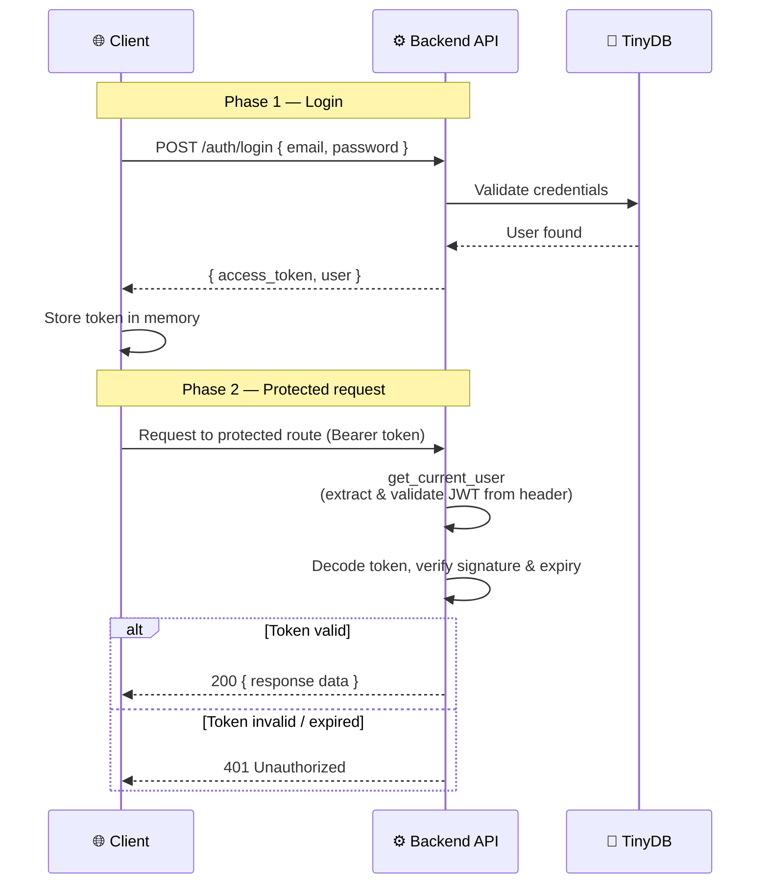

# Security Spec

> See also: [Backend Safety Rules](../rules/backend-safety.md) | [General Safety Rules](../rules/general-safety.md)

This document describes the authentication and security design for the Auth Demo. Since JWT authentication is the core feature, security considerations are first-class design constraints.

## Authentication Flow



## JWT Token Structure

### Auth Token Claims

| Claim | Type | Description |
|-------|------|-------------|
| `sub` | `str` (UUID) | The user's unique identifier |
| `exp` | `int` (Unix timestamp) | Token expiration time |
| `iat` | `int` (Unix timestamp) | Token issued-at time |

### Example Decoded Auth Token Payload

```json
{
  "sub": "550e8400-e29b-41d4-a716-446655440000",
  "exp": 1712345678,
  "iat": 1712343878
}
```

### Password Reset Token Claims

| Claim | Type | Description |
|-------|------|-------------|
| `sub` | `str` (UUID) | The user's unique identifier |
| `purpose` | `"password_reset"` | Fixed string — validates this is a reset token, not an auth token |
| `exp` | `int` (Unix timestamp) | Token expiration time (15 min) |
| `iat` | `int` (Unix timestamp) | Token issued-at time |

### Example Decoded Reset Token Payload

```json
{
  "sub": "550e8400-e29b-41d4-a716-446655440000",
  "purpose": "password_reset",
  "exp": 1712345678,
  "iat": 1712343878
}
```

### Signing

| Property | Value |
|----------|-------|
| Algorithm | `HS256` (configurable via `JWT_ALGORITHM`) |
| Secret | Loaded from `JWT_SECRET` environment variable |
| Library | `python-jose[cryptography]` |

## Password Security

| Concern | Implementation |
|---------|---------------|
| Hashing | bcrypt via `passlib[bcrypt]` — 12 rounds (configurable) |
| Plaintext storage | Never — only the bcrypt hash is stored |
| Comparison | `passlib.verify()` — constant-time comparison prevents timing attacks |
| Minimum length | 8 characters |
| Maximum length | 128 characters (reject, don't truncate) |
| Rate limiting on login | Not included in MVP — documented as known gap |

## Endpoint Security Requirements

| Endpoint | Auth Required | Notes |
|----------|---------------|-------|
| `POST /register` | No | Input validated via Pydantic; duplicate email checked |
| `POST /login` | No | Credentials verified; returns JWT on success |
| `POST /request-reset-link` | No | Always 200 — prevents email enumeration |
| `POST /reset-password` | No | Token in body; validates signature, expiry, and `purpose` claim |
| `GET /health` | No | Returns only `{ "status": "ok" }` — no sensitive data |
| `GET /user/{id}` | No | Returns public profile only (no password hash) |
| `PATCH /user/{id}` | Yes | Authenticated user may only edit their own record |
| `* /docs` | No | Swagger UI (disable in production if desired) |

## Threat Mitigations

| Threat | Mitigation |
|--------|-----------|
| Token theft / replay | Short expiry (30 min for auth, 15 min for reset); HTTPS required in production |
| Brute force login | Not implemented in MVP — password policy mitigates partially |
| SQL/NoSQL injection | TinyDB `Query()` objects prevent injection; no raw eval |
| Path traversal | All file operations validate resolved path is within allowed directory |
| Token tampering | JWT is signed; any modification invalidates the signature |
| Expired token reuse | `exp` claim checked on every request; 401 returned |
| User impersonation | `PATCH /user/{id}` enforces ownership check against token `sub` |
| Stack trace leakage | Global exception handler returns generic 500; full trace logged server-side |
| Email enumeration | `POST /auth/request-reset-link` always returns 200 |
| Auth token used as reset token | `purpose` claim is validated on reset — auth tokens lack this claim and are rejected |
| Reset token used as auth token | Reset tokens carry `purpose: "password_reset"` and `get_current_user` does not accept them |
| User deleted between token issuance and use | `POST /auth/reset-password` validates the user exists; if deleted, returns 401 |

## Known Gaps (Post-MVP)

- **Token refresh:** No refresh token flow. Users must re-authenticate after expiry.
- **Rate limiting:** No rate limiting on login or registration endpoints.
- **Account lockout:** No lockout after repeated failed login attempts.
- **Email verification:** No email confirmation step during registration.
- **Password reset:** Implemented — see the [password reset spec](password-reset.md) for details.
- **HTTPS enforcement:** Not applicable in local development; required in production.