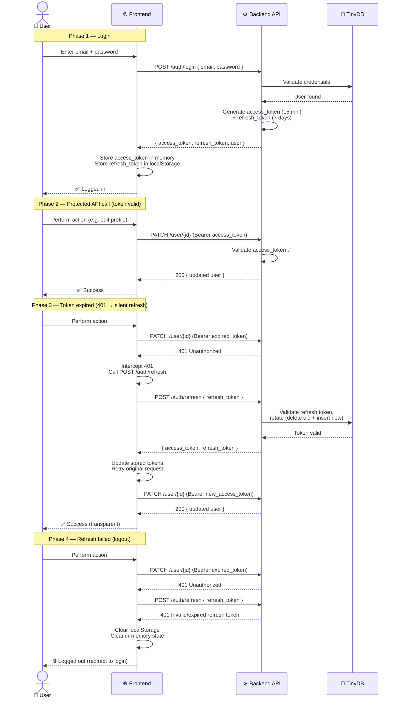

# Token Refresh Flow

> See also: [Backend Spec](backend.md) | [Security Spec](security.md) | [Password Reset Spec](password-reset.md) | [Project Architecture](project-architecture.md) | [Backend Safety Rules](../rules/backend-safety.md) | [General Safety Rules](../rules/general-safety.md) | [Frontend Safety Rules](../rules/frontend-safety.md)

This spec describes adding a **token refresh** mechanism to the Auth Demo. Currently, the access token expires after 30 minutes and the user must re-authenticate. This spec introduces a short-lived access token paired with a long-lived refresh token, plus automatic silent refresh on the frontend.

---

## Motivation

The current MVP has a single access token with a 30-minute expiry and **no refresh mechanism**. This means:

- Users are forcibly logged out every 30 minutes with no warning.
- There is no way to recover a session without presenting credentials again.
- The `apiClient` has no retry logic — if a request returns 401, the error just propagates to the UI.

Adding a refresh flow solves these problems: the access token can be short-lived (limiting the window for token theft) while the refresh token allows the client to obtain new access tokens transparently.

---

## Flow Overview



---

## Backend Changes

### New Route: `POST /auth/refresh`

| Detail | Value |
|--------|-------|
| Auth required | No (the refresh token itself is the credential) |
| Request body | `{ "refresh_token": str }` |
| Success (200) | `{ "access_token": str, "token_type": "bearer", "refresh_token": str }` |
| Errors | 401 (invalid/expired refresh token) |

#### Request / Response

```json
// Request
{
  "refresh_token": "eyJhbGciOiJIUzI1NiIs..."
}

// Response (200)
{
  "access_token": "eyJhbGciOiJIUzI1NiIs...",
  "token_type": "bearer",
  "refresh_token": "eyJhbGciOiJIUzI1NiIs..."
}
```

#### Token Rotation (Refresh Token Rotation)

Each time `POST /auth/refresh` is called, the server **issues a new refresh token** and returns it alongside the new access token. The old refresh token is **no longer valid** after rotation. This is a security best practice — if a refresh token is leaked, the attacker can only use it once before the legitimate user's next refresh invalidates it.

> **Implementation note:** To support token rotation, the backend must track which refresh tokens are currently valid. Since TinyDB is used, a simple `refresh_tokens` table stores the token hash and associated user ID. When a refresh token is used, it is removed from the table and a new one is inserted.

#### Token Reuse Detection

If a refresh token is used that has **already been rotated** (i.e., it was valid before but has since been replaced), this indicates potential token theft. In this case:

1. The refresh attempt is rejected with 401.
2. **All refresh tokens for the affected user are invalidated.** This forces the user to re-authenticate, limiting the damage from a stolen token.

This is a well-established pattern (see [RFC 6749](https://datatracker.ietf.org/doc/html/rfc6749) and [OAuth 2.0 Security Best Practices](https://datatracker.ietf.org/doc/html/draft-ietf-oauth-security-topics)).

---

### Modified Route: `POST /login`

The login response is updated to include a `refresh_token` alongside the existing `access_token` and `user`.

```json
// Response (200)
{
  "access_token": "eyJhbGciOiJIUzI1NiIs...",
  "token_type": "bearer",
  "refresh_token": "eyJhbGciOiJIUzI1NiIs...",
  "user": { "id": "uuid", "email": "str", "display_name": "str", "gravatar_url": "str" }
}
```

---

### Token Configuration

#### Access Token

| Property | Current | New |
|----------|---------|-----|
| Expiry | 30 min | **15 min** (shorter window for token theft) |
| Stored | In-memory (React context) | In-memory (React context) — unchanged |
| Config var | `JWT_EXPIRY_MINUTES` | Same (default changed to 15) |

#### Refresh Token

| Property | Value |
|----------|-------|
| Type | JWT (same HS256, same `JWT_SECRET`) |
| Claims | `sub` (user UUID), `purpose` (`"refresh"`), `exp` (expiry), `iat` (issued at), `jti` (unique token ID) |
| Expiry | **7 days** (configurable via new `JWT_REFRESH_EXPIRY_DAYS` env var) |
| Stored | **localStorage** on the frontend |
| Rotation | Yes — every refresh invalidates the old token and issues a new one |
| Reuse detection | Yes — rotated tokens are tracked; reuse invalidates all tokens for the user |

#### Example Decoded Refresh Token Payload

```json
{
  "sub": "550e8400-e29b-41d4-a716-446655440000",
  "purpose": "refresh",
  "jti": "a1b2c3d4-e5f6-7890-abcd-ef1234567890",
  "exp": 1712945678,
  "iat": 1712340878
}
```

---

### Backend Implementation Details

#### New dependencies

No new Python packages are needed — `python-jose[cryptography]` and `uuid` already cover everything.

#### New models (in `models/user.py`)

```python
class RefreshTokenRequest(BaseModel):
    """Request body for POST /auth/refresh."""
    refresh_token: str

class RefreshTokenPayload(BaseModel):
    """Internal model for a stored refresh token."""
    id: uuid.UUID = Field(default_factory=uuid.uuid4)       # unique jti
    user_id: uuid.UUID
    token_hash: str                                          # sha256 of the JWT
    expires_at: datetime
    created_at: datetime = Field(default_factory=lambda: datetime.now(UTC))
```

#### Token generation helpers (in `routers/auth.py`)

```python
import hashlib


def _create_access_token(sub: str) -> str:
    """Create a short-lived access JWT."""
    now = datetime.now(UTC)
    expire = now + timedelta(minutes=settings.jwt_expiry_minutes)
    payload = {
        "sub": sub,
        "exp": expire,
        "iat": now,
    }
    return jwt.encode(payload, settings.jwt_secret, algorithm=settings.jwt_algorithm)


def _create_refresh_token(sub: str) -> tuple[str, str, datetime]:
    """Create a long-lived refresh JWT and return (token, jti, expires_at).

    The returned jti is stored in the database so we can validate
    the token on refresh and support rotation.
    """
    now = datetime.now(UTC)
    jti = str(uuid.uuid4())
    expire = now + timedelta(days=settings.jwt_refresh_expiry_days)
    payload = {
        "sub": sub,
        "purpose": "refresh",
        "jti": jti,
        "exp": expire,
        "iat": now,
    }
    token = jwt.encode(payload, settings.jwt_secret, algorithm=settings.jwt_algorithm)
    return token, jti, expire
```

#### Refresh token storage (in `routers/auth.py` or new `routers/tokens.py`)

A `refresh_tokens` table in TinyDB stores the hash of each valid refresh token:

```python
def _store_refresh_token(db, user_id: str, jti: str, expires_at: datetime) -> None:
    """Store a refresh token hash in the database."""
    tokens_table = db.table("refresh_tokens")
    tokens_table.insert({
        "id": jti,
        "user_id": user_id,
        "token_hash": hashlib.sha256(jti.encode()).hexdigest(),
        "expires_at": expires_at.isoformat(),
        "created_at": datetime.now(UTC).isoformat(),
    })
```

#### Refresh endpoint logic

```python
@router.post("/refresh")
def refresh(body: RefreshTokenRequest) -> dict:
    """Exchange a valid refresh token for a new access token + new refresh token.

    Implements refresh token rotation and reuse detection.
    """
    try:
        payload = jwt.decode(
            body.refresh_token,
            settings.jwt_secret,
            algorithms=[settings.jwt_algorithm],
        )
        purpose: str | None = payload.get("purpose")
        if purpose != "refresh":
            raise token_invalid()

        jti: str | None = payload.get("jti")
        user_id_str: str | None = payload.get("sub")
        if not jti or not user_id_str:
            raise token_invalid()
    except JWTError:
        raise token_invalid()

    db = get_db()
    tokens_table = db.table("refresh_tokens")
    token_hash = hashlib.sha256(jti.encode()).hexdigest()

    # Look up this token in the database
    matching = tokens_table.search(
        lambda doc: doc.get("token_hash") == token_hash
    )

    if not matching:
        # Token not found — could be already rotated or never existed.
        # If the token itself is valid JWTs (not expired, properly signed)
        # but not in our DB, this is a reuse attack.
        # Check if the JWT is at least structurally valid (not expired)
        # to distinguish between "already rotated" and "never existed."
        now = datetime.now(UTC)
        exp = payload.get("exp", 0)
        if exp and datetime.fromtimestamp(exp, tz=UTC) > now:
            # The JWT is still within its expiry window but not in our DB —
            # this is a reuse attack. Invalidate all tokens for this user.
            _invalidate_all_user_tokens(db, user_id_str)

        raise token_invalid()

    stored = matching[0]
    stored_user_id = stored.get("user_id")

    if stored_user_id != user_id_str:
        raise token_invalid()

    # Remove the old token (rotation)
    tokens_table.remove(doc_ids=[matching[0].doc_id])

    # Verify the user still exists
    users_table = db.table("users")
    user_matches = users_table.search(lambda doc: doc.get("id") == user_id_str)
    if not user_matches:
        raise token_invalid()

    # Issue new tokens
    new_access_token = _create_access_token(user_id_str)
    new_refresh_token, new_jti, new_expires_at = _create_refresh_token(user_id_str)
    _store_refresh_token(db, user_id_str, new_jti, new_expires_at)

    return {
        "access_token": new_access_token,
        "token_type": "bearer",
        "refresh_token": new_refresh_token,
    }


def _invalidate_all_user_tokens(db, user_id: str) -> None:
    """Remove all refresh tokens for a given user (reuse attack response)."""
    tokens_table = db.table("refresh_tokens")
    tokens_table.remove(lambda doc: doc.get("user_id") == user_id)
```

---

### New Configuration

Add to `config.py`:

```python
jwt_refresh_expiry_days: int = 7
```

Update default for `jwt_expiry_minutes`:

```python
jwt_expiry_minutes: int = 15   # was 30
```

---

## Frontend Changes

### Updated `LoginResponse` type

```typescript
export interface LoginResponse {
  access_token: string;
  token_type: string;
  refresh_token: string;
  user: User;
}
```

### Updated `AuthContext` / `AuthProvider`

The auth context must now:

1. Store the **refresh token** in **localStorage** (in addition to the access token in memory).
2. Expose a `refreshToken` method.
3. On mount, check localStorage for an existing refresh token and attempt to obtain a new access token (session recovery on page reload).

```typescript
interface AuthContextValue {
  user: User | null;
  token: string | null;           // access token (in-memory)
  isAuthenticated: boolean;
  login: (email: string, password: string) => Promise<void>;
  logout: () => void;
  setUser: (user: User) => void;
  refreshToken: () => Promise<string | null>;  // NEW — returns new access token or null
}
```

#### Refresh token storage decision

| Property | Access Token | Refresh Token |
|----------|-------------|---------------|
| Storage | In-memory (React state) | **localStorage** |
| Rationale | Lost on reload (security) | Survives reload (session recovery) |
| XSS risk | None (memory) | Higher (localStorage read) |

The refresh token is stored in localStorage because it needs to survive page reloads so the session can be recovered. This is a pragmatic trade-off for a demo app. In production, an HTTP-only cookie would be more secure.

#### Session recovery on mount

When the `AuthProvider` mounts, it checks localStorage for a refresh token. If found, it calls `POST /auth/refresh` to get a new access token and user data. If the refresh succeeds, the user is silently authenticated. If it fails, the refresh token is removed from localStorage.

```typescript
// In AuthProvider

// On mount — attempt session recovery
const [initialising, setInitialising] = useState(true);

useEffect(() => {
  const storedRefreshToken = localStorage.getItem("refresh_token");
  if (!storedRefreshToken) {
    setInitialising(false);
    return;
  }

  (async () => {
    try {
      const data = await apiClient<RefreshResponse>("/auth/refresh", {
        method: "POST",
        body: JSON.stringify({ refresh_token: storedRefreshToken }),
      });

      localStorage.setItem("refresh_token", data.refresh_token);
      setToken(data.access_token);
      // Fetch user data — we need to get the current user profile
      // Option A: Decode the JWT to get the sub, then fetch the user
      const decoded = JSON.parse(atob(data.access_token.split(".")[1]));
      const userData = await apiClient<User>(`/user/${decoded.sub}`, {
        token: data.access_token,
      });
      setUser(userData);
    } catch {
      // Refresh failed — clear stored token
      localStorage.removeItem("refresh_token");
      setToken(null);
      setUser(null);
    } finally {
      setInitialising(false);
    }
  })();
}, []);
```

> **Note:** The `initialising` state is used to prevent the UI from flashing a logged-out state before session recovery completes. The `Navbar` and protected pages should wait for `initialising` to be `false` before rendering auth-dependent content.

#### Updated `login()` method

```typescript
const login = useCallback(async (email: string, password: string) => {
  const data = await apiClient<LoginResponse>("/auth/login", {
    method: "POST",
    body: JSON.stringify({ email, password }),
  });

  setToken(data.access_token);
  setUser(data.user);
  localStorage.setItem("refresh_token", data.refresh_token);
}, []);
```

#### Updated `logout()` method

```typescript
const logout = useCallback(() => {
  setUser(null);
  setToken(null);
  localStorage.removeItem("refresh_token");
}, []);
```

#### New `refreshToken()` method

```typescript
const refreshToken = useCallback(async (): Promise<string | null> => {
  const storedRefreshToken = localStorage.getItem("refresh_token");
  if (!storedRefreshToken) {
    return null;
  }

  try {
    const data = await apiClient<RefreshResponse>("/auth/refresh", {
      method: "POST",
      body: JSON.stringify({ refresh_token: storedRefreshToken }),
    });

    localStorage.setItem("refresh_token", data.refresh_token);
    setToken(data.access_token);
    return data.access_token;
  } catch {
    // Refresh failed — clear everything
    localStorage.removeItem("refresh_token");
    setUser(null);
    setToken(null);
    return null;
  }
}, []);
```

---

### Updated `apiClient` — Automatic 401 Retry

The `apiClient` function in `lib/api.ts` is updated to **intercept 401 responses** and attempt a silent token refresh before retrying the original request. This prevents users from seeing errors when their token expires mid-session.

The refresh flow is coordinated so that **concurrent requests** that all fail with 401 do not trigger multiple simultaneous refresh calls. A shared promise is used to serialize refresh attempts.

```typescript
// Module-level state for coordinating refresh across concurrent requests
let refreshPromise: Promise<string | null> | null = null;

export async function apiClient<T>(
  path: string,
  options: RequestInit & { token?: string } = {},
): Promise<T> {
  const { token, ...fetchOptions } = options;

  // ... (existing header setup) ...

  let response = await fetch(`${BASE_URL}${path}`, {
    ...fetchOptions,
    headers,
  });

  // ── Token refresh on 401 ──────────────────────────────────────────────
  if (response.status === 401 && token) {
    // If no refresh is in progress, start one
    if (!refreshPromise) {
      refreshPromise = doRefresh();
    }

    const newToken = await refreshPromise;

    if (newToken) {
      // Retry the original request with the new token
      headers.set("Authorization", `Bearer ${newToken}`);
      response = await fetch(`${BASE_URL}${path}`, {
        ...fetchOptions,
        headers,
      });
    }

    // Clear the promise so future 401s start a fresh refresh
    refreshPromise = null;
  }
  // ──────────────────────────────────────────────────────────────────────

  if (!response.ok) {
    // ... (existing error handling) ...
  }

  // ... (existing success handling) ...
}
```

The `doRefresh` function is a module-level helper that calls the auth context's `refreshToken` method. Since `apiClient` is a module-level function (not a React hook), it needs access to the refresh function. This is wired up via a module-level variable:

```typescript
// Set by AuthProvider on mount
let _refreshHandler: (() => Promise<string | null>) | null = null;

export function setRefreshHandler(handler: () => Promise<string | null>) {
  _refreshHandler = handler;
}

async function doRefresh(): Promise<string | null> {
  if (!_refreshHandler) return null;
  return _refreshHandler();
}
```

The `AuthProvider` calls `setRefreshHandler` with its `refreshToken` method on mount.

> **Alternative approach:** Instead of a module-level handler, the `apiClient` could accept an optional `onRefresh` callback parameter. However, since most calls go through the same `apiClient`, the module-level handler is simpler and avoids threading the refresh function through every call site.

---

### `RefreshResponse` type

```typescript
export interface RefreshResponse {
  access_token: string;
  token_type: string;
  refresh_token: string;
}
```

---

### `isAuthenticated` guard with `initialising`

The `isAuthenticated` check in `AuthContext` should also account for the `initialising` state. The `AuthProvider` exposes a `ready` flag:

```typescript
interface AuthContextValue {
  user: User | null;
  token: string | null;
  isAuthenticated: boolean;
  ready: boolean;          // NEW — true after initial session recovery attempt
  login: (email: string, password: string) => Promise<void>;
  logout: () => void;
  setUser: (user: User) => void;
}
```

Components that guard on `isAuthenticated` should also check `ready`:

```typescript
// In protected pages
if (!ready) {
  return null; // Or a loading spinner — session recovery in progress
}

if (!isAuthenticated) {
  router.replace("/login");
  return null;
}
```

Or, alternatively, the `Navbar` and page components can simply show nothing until `ready` is true, preventing a flash of logged-out UI.

---

### Loading State During Session Recovery

To prevent a flash of logged-out content on page load, the `AuthProvider` should render a loading state (or nothing) while the initial session recovery attempt is in progress. The simplest approach is to expose the `ready` flag and let consuming components decide.

A recommended approach for the `Navbar`:

```typescript
export function Navbar() {
  const { user, isAuthenticated, ready, logout } = useAuth();

  // Don't render anything until we know the auth state
  if (!ready) {
    return (
      <nav className="flex items-center justify-between border-b border-zinc-800 px-6 py-3">
        <span className="text-lg font-semibold tracking-tight text-white">
          Auth Demo
        </span>
      </nav>
    );
  }

  // ... rest of the navbar ...
}
```

---

## Error Scenarios

### Scenario 1: Token expires mid-session

1. User logs in, receives access token (15 min) + refresh token (7 days).
2. User browses the app. After 15 minutes, the access token expires.
3. User clicks "Edit Profile" → `PATCH /user/{id}` is called with the expired token.
4. Backend returns 401.
5. `apiClient` intercepts the 401, calls `POST /auth/refresh` with the stored refresh token.
6. Backend validates the refresh token, rotates it, and returns new access + refresh tokens.
7. `apiClient` retries the original `PATCH` request with the new access token.
8. Profile update succeeds. User sees no errors.

### Scenario 2: Refresh token expires

1. User logs in, then closes the browser for 8 days.
2. User returns and the app tries to recover the session from localStorage.
3. `AuthProvider` on mount calls `POST /auth/refresh`.
4. The refresh token JWT has expired (7-day expiry). Backend returns 401.
5. `AuthProvider` clears the stored refresh token from localStorage.
6. User sees the logged-out UI and must log in again.

### Scenario 3: Refresh token reuse (theft detection)

1. Attacker steals the refresh token from localStorage (XSS).
2. Attacker calls `POST /auth/refresh` and gets a new access token + rotated refresh token.
3. The legitimate user's next API call triggers a 401 → `apiClient` calls `POST /auth/refresh`.
4. The original refresh token has already been rotated — it's no longer in the DB.
5. Backend detects reuse, invalidates ALL refresh tokens for the user.
6. The legitimate user's refresh fails, and they are logged out.
7. Both the attacker and the legitimate user must re-authenticate.

### Scenario 4: Network error during refresh

1. Access token expires, request returns 401.
2. `apiClient` attempts refresh, but the network is down.
3. `doRefresh()` throws (fetch fails) → `apiClient` returns the original 401 error to the caller.
4. The calling component shows the error message as usual.
5. When the network recovers, the next request will trigger another refresh attempt.

---

## Security Considerations

| Concern | Mitigation |
|---------|-----------|
| Refresh token stolen from localStorage | XSS protection is essential. In production, use HTTP-only cookies. |
| Refresh token reuse | Rotation + reuse detection with automatic invalidation of all user tokens. |
| Access token stolen | Short expiry (15 min) limits the window. Access token cannot be used to obtain new tokens. |
| Refresh token used as access token | `get_current_user` checks only for auth tokens (no `purpose` claim). A refresh token passed to a protected route returns 401. |
| Access token used as refresh token | `POST /auth/refresh` validates the `purpose: "refresh"` claim. An access token lacks this claim and is rejected. |
| Concurrent refresh storms | `refreshPromise` serializes concurrent refresh attempts — only one `POST /auth/refresh` call is made, and all concurrent 401s share the result. |
| Session recovery on every page load | Only one `POST /auth/refresh` call on mount. Subsequent API calls use the obtained access token. |

---

## Frontend Types Summary

```typescript
// lib/api.ts — additions

export interface RefreshResponse {
  access_token: string;
  token_type: string;
  refresh_token: string;
}

// Updated LoginResponse
export interface LoginResponse {
  access_token: string;
  token_type: string;
  refresh_token: string;     // NEW
  user: User;
}
```

```typescript
// lib/auth.tsx — updated context

interface AuthContextValue {
  user: User | null;
  token: string | null;
  isAuthenticated: boolean;
  ready: boolean;              // NEW
  login: (email: string, password: string) => Promise<void>;
  logout: () => void;
  setUser: (user: User) => void;
  refreshToken: () => Promise<string | null>;  // NEW
}
```

---

## Implementation Order

1. **Backend:** Add `RefreshTokenRequest` model to `models/user.py`.
2. **Backend:** Add `jwt_refresh_expiry_days` to `config.py`; change `jwt_expiry_minutes` default to 15.
3. **Backend:** Add `_create_refresh_token`, `_store_refresh_token`, `_invalidate_all_user_tokens` helpers to `routers/auth.py`.
4. **Backend:** Update `POST /login` to include `refresh_token` in the response.
5. **Backend:** Add `POST /auth/refresh` endpoint with rotation and reuse detection.
6. **Backend:** Add `"TOKEN_EXPIRED"` error code to `exceptions.py` for explicit expiry reporting (optional, but useful for distinguishing "expired" from "invalid").
7. **Frontend:** Update `LoginResponse` and add `RefreshResponse` type in `lib/api.ts`.
8. **Frontend:** Add `setRefreshHandler` export and `doRefresh` helper to `lib/api.ts`.
9. **Frontend:** Add 401 interceptor with refresh retry logic to `apiClient`.
10. **Frontend:** Update `AuthProvider` with `ready` state, `refreshToken` method, session recovery on mount, and `setRefreshHandler` wiring.
11. **Frontend:** Update `LoginForm` (no changes needed — `login()` handles storage internally).
12. **Frontend:** Update `Navbar` to handle `ready` state.
13. **Frontend:** Update protected pages to handle `ready` state.

---

## Known Gaps

| Gap | Impact |
|-----|--------|
| Refresh token in localStorage is XSS-able | In production, use HTTP-only cookies. This is a pragmatic choice for the demo. |
| No refresh token blacklist for logout | Currently, logging out just clears the client-side token. The server-side token remains valid until expiry. A token blacklist could be added for immediate invalidation. |
| No rate limiting on `/auth/refresh` | An attacker with a valid refresh token could call `/auth/refresh` repeatedly, each time getting a new token pair. Rate limiting should be added in production. |
| `jwt_secret` is shared between access and refresh tokens | Using a separate `JWT_REFRESH_SECRET` would be more secure. The `purpose` claim provides separation at the cost of sharing the signing key. |